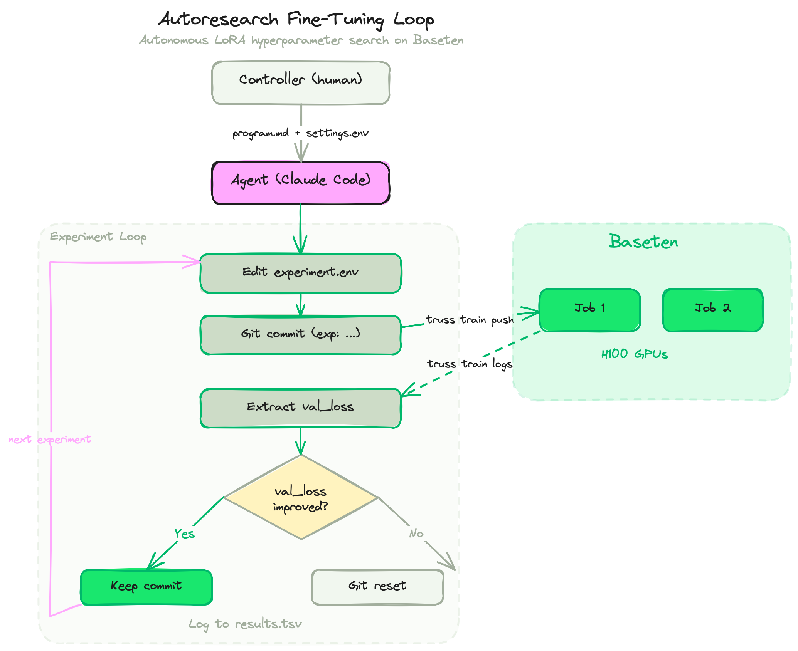

# Autoresearch Fine-Tuning on Baseten

Andrej Karpathy's [autoresearch](https://github.com/karpathy/autoresearch) introduced a compelling division of labor: humans program the research organization, and an AI agent does the experimentation. This example applies that pattern to LoRA fine-tuning on Baseten.

Fine-tuning a large language model involves dozens of interacting hyperparameters (LoRA rank, learning rate, batch size, sequence length, recomputation depth), and the best configuration depends on your model, dataset, and hardware. This example turns that search into an autonomous loop: a Claude Code agent proposes hyperparameter changes, submits each experiment to Baseten as a containerized training job, parses the validation loss from the logs, and decides whether to keep or discard the result. The loop runs continuously, without human intervention, until it exhausts a GPU budget you control.

Under the hood, each experiment runs [MS-Swift](https://github.com/modelscope/ms-swift) with MegatronLM for LoRA fine-tuning, though Baseten Training is framework-agnostic and the same autoresearch pattern works with Hugging Face Transformers, TRL, Axolotl, or plain PyTorch (see the other examples in this repository and the [Baseten Training docs](https://docs.baseten.co/training/overview) for more). The agent's entire search space lives in a single file, `training/experiment.env`, which contains every tunable parameter as a shell variable. A fixed entrypoint (`run.sh`) maps those variables to `megatron sft` CLI flags, so the agent never touches the training infrastructure itself. This separation keeps experiments reproducible: each git commit captures the exact configuration that produced a given result.

<picture>
  <source media="(prefers-color-scheme: dark)" srcset="../../images/autoresearch-darkmode.png">
  <source media="(prefers-color-scheme: light)" srcset="../../images/autoresearch-lightmode.png">
  
</picture>

The default configuration fine-tunes Qwen3-8B on the [pirate-ultrachat-10k](https://huggingface.co/datasets/winglian/pirate-ultrachat-10k) instruction dataset using 2 H100 GPUs. A baseline run takes roughly 12 minutes (including container startup and 100 training iterations), and in our testing, 14 experiments over a few hours reduced validation loss by 8.6%, progressing from a LoRA rank of 8 with a 1e-4 learning rate to rank 64 with 8e-4 and a doubled batch size.

## Prerequisites

1. A [Baseten account](https://baseten.co/signup) with H100 GPU access.
2. The Truss CLI installed and configured (`pip install -U truss && truss login`).
3. A Hugging Face access token stored as a Baseten secret named `hf_access_token`.

If you need H100 access or a higher GPU quota, [reach out to us](mailto:support@baseten.co).

## Getting started

Clone the repository and navigate to the example:

```bash
git clone https://github.com/basetenlabs/ml-cookbook.git
cd ml-cookbook/examples/autoresearch-finetune
```

Before starting, review `settings.env`. The defaults are designed to work out of the box on 2 H100 GPUs, but you can change the model to any Hugging Face path, swap the dataset, or adjust the GPU count to match your allocation. If you want the agent to stop after a fixed number of experiments, set `TOTAL_BUDGET` to a number like 10 or 25 to control spend. By default, the loop runs until you interrupt it.

Once you're satisfied with the settings, launch Claude Code (or any Agent harness like [OpenCode](https://opencode.ai/)) in this directory and tell the agent to run autoresearch:

```bash
claude --dangerously-skip-permissions
```

The agent reads `program.md` for its instructions, creates a git branch for the run, submits a baseline experiment with the default hyperparameters, and then begins iterating. Each experiment modifies `training/experiment.env`, commits the change, pushes a training job to Baseten, and logs the outcome to `results.tsv`. Improvements are kept on the branch; regressions are discarded via git reset.

## Changing the model or dataset

The model and dataset are configured in `settings.env`, not in the training code. Set `MODEL` to any Hugging Face model path, such as `nvidia/Llama-3.1-Nemotron-70B-Instruct-HF` or `Qwen/Qwen3-30B-A3B`. If MS-Swift cannot auto-detect the architecture (which can happen with very new or custom models), also set `MODEL_TYPE` to the appropriate MS-Swift model type string.

The dataset works the same way: set `DATASET` to any Hugging Face dataset that MS-Swift can consume. The held-out validation split is controlled by `EVAL_SPLIT_RATIO` (defaulting to 1%), and the agent hill-climbs on the validation loss that Megatron computes on that split.

## Running parallel experiments

By default, the agent runs one experiment at a time. Setting `PARALLEL_JOBS=2` (or higher) tells the agent to generate multiple hyperparameter variants per iteration, submit them all to Baseten simultaneously, and keep only the best result. This increases throughput roughly proportionally at the cost of more GPU-hours per iteration.

To cap total spend, combine parallel jobs with a budget. For example, `PARALLEL_JOBS=2` with `TOTAL_BUDGET=20` runs up to 2 concurrent jobs at a time across 20 total experiments, consuming at most 40 GPU-job-equivalents.

## File reference

The agent modifies only `training/experiment.env` during the experiment loop. Every other file is read-only:

- **`training/experiment.env`** contains the tunable hyperparameters: LoRA rank and alpha, learning rate, batch size, sequence length, recomputation settings, and data loading workers. Each variable maps directly to a `megatron sft` CLI flag.
- **`training/run.sh`** sources `experiment.env`, constructs the `megatron sft` command, and after training completes, parses the final validation loss and peak GPU memory from the Megatron logs into a structured results block.
- **`training/config.py`** reads `settings.env` and defines the Baseten training job, including the base image, environment variables, GPU allocation, and caching configuration.
- **`program.md`** contains the agent's full instructions: setup procedure, experiment loop, search space guidance, results logging format, and rules for parallel mode. The agent uses `truss train logs` to monitor job progress and fetch results.
- **`settings.env`** holds user-facing configuration that the agent reads but does not modify: model path, dataset, GPU type and count, parallelism, and budget.
