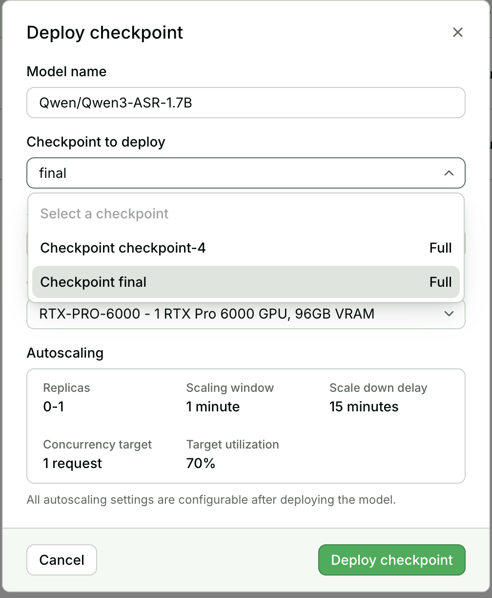
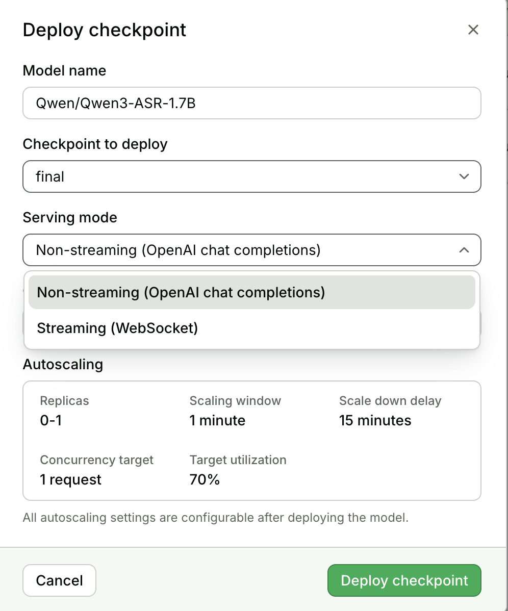
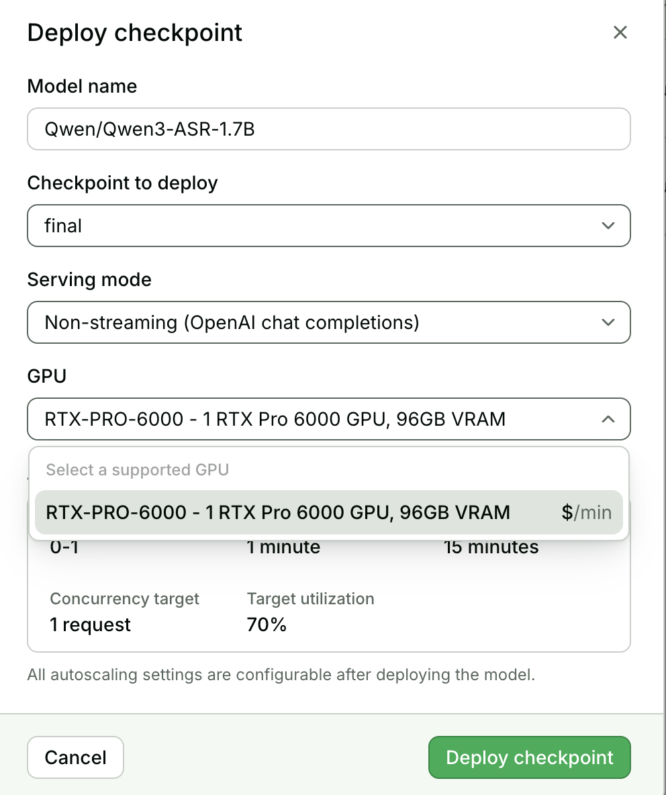

# Fine-tune Qwen3-ASR-1.7B with Transformers

This example full-fine-tunes
[`Qwen/Qwen3-ASR-1.7B`](https://huggingface.co/Qwen/Qwen3-ASR-1.7B)
on audio/transcript pairs using the Qwen team's
[official SFT recipe](https://github.com/QwenLM/Qwen3-ASR/tree/main/finetuning).
It adds a reusable Hugging Face dataset-preparation step, Baseten checkpoint
persistence, an H100 preset, evaluation, and a guaranteed `final/` checkpoint.

The default running example prepares 800 utterances from LibriSpeech
`train-clean-100`, holds out 40 for validation, and trains for one epoch.

## Baseten quickstart

The default Qwen3-ASR model and LibriSpeech dataset are public, so the default
job does not require a Hugging Face token. Follow the
[Baseten Training quickstart](https://docs.baseten.co/training/getting-started)
to install the current Baseten CLI and `uv`, then log in and submit the recipe:

```bash
baseten auth login
cd examples/qwen3-asr-transformers/training
baseten train push --config config.py
```

Use a CLI version whose `baseten --help` lists `train`; upgrade older versions
before following these commands. The Baseten CLI runs training commands through
Truss and forwards authentication, so a separate Truss login is unnecessary.

### Hugging Face authentication (optional)

For a gated or private Hugging Face dataset, first create a secret containing
your Hugging Face token in the Baseten workspace. Then set
`HF_TOKEN_SECRET_NAME` to that secret's name when submitting the job:

```bash
HF_TOKEN_SECRET_NAME=hf_access_token baseten train push --config config.py
```

`HF_TOKEN_SECRET_NAME` is read while `training/config.py` is loaded. When it is
set, the config exposes the referenced Baseten secret to the training container
as `HF_TOKEN`; the token value is not stored in this recipe. When it is unset,
the `HF_TOKEN` environment variable is omitted entirely. A secret named
`hf_access_token` is only a convention—you can use any existing Baseten secret
name.

If that project name already exists in your organization, override it only for
submission:

```bash
TRAINING_PROJECT_NAME="My Qwen3-ASR fine-tune" baseten train push --config config.py
```

The default compute profile in `training/config.py` is:

| Resource | Value | Why |
| --- | ---: | --- |
| GPU | `1x H100` | Default; set `GPU_COUNT=2`, `4`, or `8` for single-node DDP |
| CPU | `8` cores | Single-GPU request; multi-GPU presets request 16 |
| RAM | `64Gi` | Single-GPU request; multi-GPU presets request 96 GiB |
| FlashAttention build jobs | `MAX_JOBS=4` | Prevents an accidental source build from exhausting host RAM |

The model weights are mounted at `/app/models/Qwen/Qwen3-ASR-1.7B`, dataset
artifacts use the Baseten read/write cache, and checkpoints are written under
`$BT_CHECKPOINT_DIR` so they survive job teardown.

### Multi-GPU training with torchrun

Multi-GPU training follows the same `torchrun --nproc-per-node=$BT_NUM_GPUS`
pattern used by the repository's other distributed recipes. Request two H100s
by setting `GPU_COUNT` while submitting the config:

```bash
GPU_COUNT=2 \
TRAINING_PROJECT_NAME="Qwen3-ASR-1.7B Finetuning (2x H100 DDP)" \
baseten train push --config config.py
```

The training config accepts `GPU_COUNT=1`, `2`, `4`, or `8`. On Baseten,
`training/run.sh` reads the injected `BT_NUM_GPUS` value and launches one
Hugging Face Trainer process per GPU. For a local single-node run, use the
equivalent:

```bash
NUM_GPUS=2 GRAD_ACC=8 ./run.sh
```

The config scales the default gradient accumulation from `16` on one GPU to
`8`, `4`, or `2` on 2, 4, or 8 GPUs, respectively. With the default per-device
batch size of 8, every preset therefore keeps the global effective batch at
128. Override `GRAD_ACC` when submitting the config if a different global batch
is intentional.

## Monitor a training job

Use the job ID returned by submission to follow logs, or open the job in the
[Baseten Training dashboard](https://app.baseten.co/training/) for status, logs,
metrics, and checkpoints:

```bash
baseten train project list
baseten train job list --project "Qwen3-ASR-1.7B Finetuning (SFT)"
baseten train job logs --job-id YOUR_JOB_ID --tail
```

If you override the project name, use that name in `job list`. See the
[job management guide](https://docs.baseten.co/training/management) for lifecycle
and stop commands. Job completion and successful checkpoint synchronization
should both be checked before deploying a checkpoint.

### Optional experiment tracking

Reporting defaults to `REPORT_TO=none`. Baseten job status, logs, and checkpoint
storage work without a tracking account. To opt in, choose `wandb` or
`tensorboard` when submitting `training/config.py`. No trainer edits are needed.
An unknown tracker or incomplete W&B configuration fails before submission.

`run.sh` installs the selected package from `requirements.wandb.txt` or
`requirements.tensorboard.txt` into the **remote training container's `.venv`**.
Installing it on your laptop is not sufficient. In disabled mode, neither
optional requirements file is installed.

#### W&B setup

You need a W&B account with write access to the chosen project. Ask your W&B
team administrator for access if needed. `WANDB_ENTITY` is the W&B team or user
slug, separate from the Baseten team name; Baseten and Hugging Face access do
not grant W&B access.

1. Choose a W&B entity and project, and check its visibility in W&B.
2. Create an API key in [W&B settings](https://wandb.ai/settings).
3. Store the key as a Baseten secret, for example `wandb_api_key`, accessible
   to the training job's team. Put the key value only in the secret store.
4. From `training/`, submit with the secret **name**, not its value:

```bash
REPORT_TO=wandb \
WANDB_API_KEY_SECRET_NAME=wandb_api_key \
WANDB_ENTITY=YOUR_WANDB_TEAM_OR_USERNAME \
WANDB_PROJECT=qwen3-asr \
RUN_NAME=qwen3-asr-experiment-001 \
baseten train push --config config.py
```

The config maps the secret to `WANDB_API_KEY` inside the container and forwards
only the named tracking settings. No interactive `wandb login` is needed in the
job. The container needs outbound access to W&B. The run URL appears in the
Baseten job logs; it is also available in your W&B project.

This setup logs trainer metrics, configuration, and system statistics. It
explicitly disables model-checkpoint uploads, gradient watching, console
capture, and code saving. Model checkpoints remain in Baseten; the recipe does
not log audio or transcripts to W&B. Use a new `RUN_NAME` to distinguish
experiments. Resuming a Trainer checkpoint creates a new tracking run; it does
not automatically resume the previous W&B run.

#### TensorBoard setup

TensorBoard needs no hosted account or API key. From `training/`:

```bash
REPORT_TO=tensorboard RUN_NAME=qwen3-asr-experiment-001 \
baseten train push --config config.py
```

The trainer writes events to `$BT_CHECKPOINT_DIR/tensorboard/` on Baseten
(`./output/tensorboard/` for the default local output). After the job completes
and checkpoint synchronization finishes, retrieve and download its event files:

```bash
baseten train checkpoint files --job-id YOUR_JOB_ID --output json > checkpoint-urls.json
python3 - <<'PY'
import json
from pathlib import Path
from urllib.request import urlretrieve

output = Path("downloaded-events")
output.mkdir(exist_ok=True)
events = [item for item in json.loads(Path("checkpoint-urls.json").read_text())
          if Path(item["relative_file_name"]).name.startswith("events.out.tfevents.")]
if not events:
    raise SystemExit("No event files found; check job logs and checkpoint sync status.")
for index, item in enumerate(events):
    urlretrieve(item["url"], output / f"events.out.tfevents.download-{index}")
PY
```

The URLs expire; regenerate them if needed. Keep `checkpoint-urls.json` private
and delete it after downloading.

To view downloaded logs on your laptop, install TensorBoard in a separate local
virtual environment:

```bash
python3 -m venv .tensorboard-venv
.tensorboard-venv/bin/python -m pip install tensorboard==2.20.0 setuptools==80.9.0
.tensorboard-venv/bin/tensorboard --logdir ./downloaded-events --host 127.0.0.1
```

TensorBoard 2.20.0 still imports `pkg_resources`, which setuptools removed in
version 82. The setuptools pin keeps this local viewer compatible.

Open the localhost URL printed by TensorBoard. `--logdir` must contain the
downloaded `events.out.tfevents.*` files. Live viewing requires a separate event
sync or tunnel; this workflow describes downloaded logs.

#### Disable reporting or use a custom configuration

Omit `REPORT_TO`, or set `REPORT_TO=none` when submitting `config.py`. W&B
credentials are then neither required nor forwarded, even if W&B settings are
present in your local shell.

These submission variables are handled by `config.py`; other custom presets
must forward them through their own `Runtime.environment_variables`. A W&B
preset must use a `SecretReference` for `WANDB_API_KEY`, not a literal key.
When invoking the trainer directly, use `--report_to wandb` or
`--report_to tensorboard` and optionally `--run_name`; direct Python users must
install the selected requirements file and provide W&B authentication themselves.

#### What these charts measure

Both integrations display metrics computed by the trainer, including training
loss, learning rate, and validation loss when validation runs. They do not
compute WER, M-WER, or Drug M-WER. Those require a separate ASR evaluation step.
Choose checkpoints on development data and reserve test sets for final evaluation.

See [W&B's Hugging Face integration](https://docs.wandb.ai/models/integrations/huggingface),
[Trainer callbacks](https://huggingface.co/docs/transformers/main_classes/callback),
and [TensorBoard's guide](https://www.tensorflow.org/tensorboard/get_started).

## What the recipe does

`training/run.sh` executes the complete pipeline:

1. Creates an isolated virtual environment and installs Qwen3-ASR plus a
   prebuilt FlashAttention 2 wheel.
2. Runs `training/prepare.py` to download and resample a Hugging Face audio
   dataset, filter long clips, materialize 16 kHz WAV files, and write
   train/eval JSONL.
3. Runs the adapted upstream `training/qwen3_asr_sft.py` trainer in BF16 with
   FlashAttention 2.
4. Saves periodic Trainer checkpoints and a stable, self-contained
   `$BT_CHECKPOINT_DIR/final` checkpoint.

## Dataset requirements

The preparation utility accepts any Hugging Face dataset with:

- an audio column, selected with `AUDIO_COLUMN` (default: `audio`)
- a transcript column, selected with `TEXT_COLUMN` (default: `text`)
- an optional ID column used for filenames (default: `id`)

The prepared manifest follows Qwen3-ASR's native target format:

```jsonl
{"audio":"/absolute/path/0000000-84-121123-0000.wav","text":"language English<asr_text>CHAPTER ONE ..."}
```

If language labels are unavailable, set `LANGUAGE=`. The target will use
`language None<asr_text>...`; as the upstream guide notes, the model then does
not learn language detection from that prefix.

### Dataset controls

| Variable | Default | Description |
| --- | --- | --- |
| `DATASET_REPO` | `openslr/librispeech_asr` | Hugging Face dataset repository |
| `DATASET_CONFIG` | `clean` | Dataset subset/config; empty means none |
| `DATASET_SPLIT` | `train.100` | Source split |
| `AUDIO_COLUMN` | `audio` | Audio feature column |
| `TEXT_COLUMN` | `text` | Transcript column |
| `ID_COLUMN` | `id` | Optional stable sample identifier |
| `LANGUAGE` | `English` | Qwen output-language label |
| `MAX_SAMPLES` | `800` | Maximum accepted examples; empty means all |
| `MAX_DURATION_SECONDS` | `30` | Skip clips above this duration |
| `EVAL_SAMPLES` | `40` | Deterministic validation holdout; `0` disables eval |
| `DATASET_SEED` | `42` | Train/eval split seed |

For another dataset:

```bash
DATASET_REPO=mozilla-foundation/common_voice_17_0 \
DATASET_CONFIG=en \
DATASET_SPLIT=train \
TEXT_COLUMN=sentence \
ID_COLUMN=client_id \
LANGUAGE=English \
MAX_SAMPLES=2000 \
./run.sh
```

For multilingual data, prepare each language separately with its correct Qwen
language name and concatenate the resulting JSONL files before training.

## H100 training preset

| Variable | Default | Description |
| --- | ---: | --- |
| `BATCH_SIZE` | `8` | Per-device micro-batch size |
| `GRAD_ACC` | `16 / GPU_COUNT` | Gradient accumulation steps; the config preserves global batch 128 |
| `LR` | `2e-5` | AdamW learning rate from the upstream recipe |
| `EPOCHS` | `1` | Dataset passes |
| `WARMUP_RATIO` | `0.02` | Linear warmup fraction |
| `SAVE_STRATEGY` | `epoch` | Save/evaluate at epoch boundaries |
| `SAVE_TOTAL_LIMIT` | `3` | Maximum periodic checkpoints retained |
| `NUM_WORKERS` | `4` | Trainer data-loader workers |
| `GRADIENT_CHECKPOINTING` | `0` | Set to `1` to trade compute for lower activation memory |

The effective batch size is:

```text
BATCH_SIZE × GRAD_ACC × number_of_GPUs
```

The default is therefore `8 × 16 × 1 = 128`. The two-GPU preset uses
`8 × 8 × 2 = 128`, matching the effective single-GPU batch of the upstream
`batch_size=32, grad_acc=4` example while using much less peak activation
memory per device.

### Batch size and VRAM

Full fine-tuning has a large fixed cost for model weights, gradients, and
optimizer state. Batch size mainly changes activation memory:

```text
peak VRAM ≈ fixed training state + activations(batch size, padded audio length)
```

Every batch is padded to its longest recording, so one long sample raises the
memory cost of the entire batch. The 30-second preparation limit protects the
default run, but grouping production data into similar-duration buckets is
still recommended.

Useful adjustments:

```bash
# Lower peak VRAM while preserving effective batch 128.
BATCH_SIZE=4 GRAD_ACC=32 ./run.sh

# Lower activation memory further at the cost of extra computation.
BATCH_SIZE=4 GRAD_ACC=32 GRADIENT_CHECKPOINTING=1 ./run.sh

# Try the upstream H100-sized micro-batch after validating clip lengths.
BATCH_SIZE=32 GRAD_ACC=4 ./run.sh
```

Gradient accumulation does not hold all accumulated micro-batches in memory;
it retains gradients while processing each micro-batch sequentially. Ordinary
DDP also does not pool VRAM: each GPU stores a complete model and processes its
own per-device batch.

The single-GPU preset requests 8 CPUs and 64 GiB RAM. Baseten selects an instance
that satisfies the entire compute request; larger CPU/RAM requirements can
result in additional GPUs. The launcher checks the allocated GPU count against
`GPU_COUNT` before installing dependencies or training, so an unexpected
allocation fails instead of changing the effective batch size.

The trainer uses `use_reentrant=False` when gradient checkpointing is enabled.
Qwen's audio encoder is called once per audio sample; reentrant checkpointing
can mark the same parameter ready twice under DDP when a micro-batch contains
multiple clips. Keep this setting when adapting the trainer.

Training batches explicitly use right padding so the collator masks the prompt
and padding while supervising the reference tokens. Qwen's processor otherwise
defaults to left padding. The model also declares `accepts_loss_kwargs=False`:
its loss is a micro-batch mean and does not use Trainer's `num_items_in_batch`,
so Trainer must apply gradient-accumulation normalization.

Losses from runs with left-padded, mixed-length batches are not directly
comparable with corrected runs: the old mask included prompt tokens in the
loss. Successful training and finite loss alone do not verify label masking.

Before a full run, test the actual GPU count, per-device batch size, gradient
accumulation, checkpointing setting, and pinned dependencies on a small portion
of the intended training and development splits. Use `MAX_STEPS` to bound the
run and `SAVE_STRATEGY=steps SAVE_STEPS=2` to exercise evaluation and checkpoint
writing. Confirm finite losses, completed optimizer steps, TensorBoard events
when enabled, and a successful reload of `final/`. A tracking test with
checkpointing disabled does not validate the checkpointed DDP path.

### Dataset download progress

The launcher leaves `HF_HUB_ENABLE_HF_TRANSFER` unset and uses the Hub's default
transfer behavior. This recipe prepares datasets through `load_dataset` in
`prepare.py`; it does not configure snapshot file-download workers. No dataset
download speedup has been established for this default path.

Custom loaders using `snapshot_download` have different behavior: in
`huggingface-hub` 0.36.x, enabling that flag selects a serial file loop instead
of the thread pool controlled by `max_workers`. This distinction matters for
datasets with many small files. Measure acquisition separately from validation
and training, record cache state, and keep download progress enabled.

For custom dataset loaders, set a preparation timeout and monitor downloaded
files or bytes. The platform's `RUNNING` status includes preparation; require
an optimizer-step record before reporting training throughput or an ETA.

## Local usage

The same pipeline runs locally on a CUDA machine:

```bash
cd examples/qwen3-asr-transformers/training
./run.sh
```

For a quick end-to-end smoke test, use the tiny LibriSpeech fixture:

```bash
DATASET_REPO=hf-internal-testing/librispeech_asr_dummy \
DATASET_CONFIG=clean \
DATASET_SPLIT=validation \
MAX_SAMPLES=16 \
EVAL_SAMPLES=2 \
BATCH_SIZE=2 \
GRAD_ACC=2 \
./run.sh
```

To prepare data without starting training:

```bash
python prepare.py \
  --dataset_repo openslr/librispeech_asr \
  --dataset_config clean \
  --dataset_split train.100 \
  --max_samples 800 \
  --eval_samples 40
```

## Checkpoints and resume

Periodic checkpoints are written as `checkpoint-<global_step>`. The trainer
also always writes `final/`, even when a small smoke test does not reach
`SAVE_STEPS`. Each directory includes the processor/tokenizer metadata needed
by `Qwen3ASRModel.from_pretrained`.

To resume locally from the latest periodic checkpoint:

```bash
source .venv/bin/activate
python qwen3_asr_sft.py \
  --model_path Qwen/Qwen3-ASR-1.7B \
  --train_file train.jsonl \
  --eval_file eval.jsonl \
  --output_dir output \
  --resume 1
```

## Quick inference check

```python
import torch
from qwen_asr import Qwen3ASRModel

model = Qwen3ASRModel.from_pretrained(
    "output/final",
    dtype=torch.bfloat16,
    device_map="cuda:0",
    attn_implementation="flash_attention_2",
)

result = model.transcribe(audio="path/to/test.wav")
print(result[0].language)
print(result[0].text)
```

## Deploy a fine-tuned checkpoint

After the training job completes and the `final` FULL checkpoint finishes
syncing, deploy it directly from the Baseten Training UI:

1. Open the completed job's **Overview** page and click **Deploy** next to the
   `final` checkpoint. Prefer `final` over a periodic checkpoint because it
   omits optimizer state and is smaller to materialize for inference.
2. Enter the model name. Using an existing model name in the same team creates
   a new model version; a new name creates a new model.
3. Select **Non-streaming (OpenAI chat completions)** or **Streaming
   (WebSocket)**. The menu contains only serving templates compatible with the
   checkpoint's exact base model, architecture, and FULL checkpoint type.
4. Select a supported GPU and click **Deploy checkpoint**. The deployment is
   created in the Training job's team, and the GPU menu contains only the
   instance types supported by the selected template.

| Select the checkpoint | Select the serving mode | Select a supported GPU |
| --- | --- | --- |
|  |  |  |

The deployment automatically replaces the template's public base-model weight
with the selected Training checkpoint and points `BASETEN_MODEL_PATH` at the
materialized checkpoint directory. You do not need to download the checkpoint,
edit a Truss config, or add a Hugging Face secret for this public model.

For a non-streaming deployment, send an audio input to
`/v1/chat/completions` from the model Playground or an OpenAI-compatible
client. For a streaming deployment, connect a WebSocket client to the selected
deployment:

```text
wss://model-<MODEL_ID>.api.baseten.co/deployment/<DEPLOYMENT_ID>/websocket
```

Use different model names if the non-streaming and streaming deployments need
to remain active at the same time.

### Manual deployment with Truss

The [`truss/`](truss) directory serves the persisted `final/` checkpoint with
the same pinned vLLM stack and OpenAI-compatible chat-completions API as
Baseten's
[`qwen3-asr-1.7b` model-registry preset](https://github.com/basetenlabs/model-registry/tree/main/stt/qwen3-asr-1.7b/latency).

Use this path when developing or customizing the serving Truss. First, get the
completed training job ID from the training logs or CLI:

```bash
baseten train job list
```

Then replace both occurrences of `abc123` in `truss/config.yaml` with that job
ID. The artifact path for this single-node recipe is `rank-0/final`:

```yaml
training_checkpoints:
  download_folder: /models/training_checkpoints
  artifact_references:
    - training_job_id: YOUR_JOB_ID
      paths:
        - "rank-0/final"
```

Push the deployment from the Truss directory:

```bash
cd examples/qwen3-asr-transformers/truss
baseten truss push
```

After the model finishes deploying, install the OpenAI client, put its model ID
and deployment ID into `call.py`, then transcribe the included public test URL:

```bash
pip install openai
python call.py
```

To transcribe a local file, `call.py` converts it to an audio data URL before
sending it:

```bash
AUDIO_PATH=path/to/test.wav python call.py
```

You can also set `AUDIO_URL` to a directly accessible audio URL. The deployment
uses vLLM's native Qwen3-ASR support and exposes `/v1/chat/completions`; its
response has the native
`language <LANGUAGE><asr_text><TRANSCRIPT>` format.

### Where the checkpoint is stored

During a Baseten training job, `$BT_CHECKPOINT_DIR` is a mounted local path in
the training container. The checkpointing configuration in
`training/config.py` automatically synchronizes files written there to
Baseten-managed cloud storage, so they remain available after the training
machine is torn down.

At deploy time, `training_checkpoints` downloads the selected cloud artifact
into the inference container. For example, job `abc123` is available to the
server at:

```text
/models/training_checkpoints/abc123/rank-0/final
```

This is therefore not only a local-on-disk checkpoint, and you do not need to
download it and upload it again. Baseten's documentation describes the backing
store as Baseten storage or cloud storage rather than promising a
user-managed S3 bucket. If you run this recipe locally instead,
`training/run.sh` falls back to `training/output/`; that local directory is not
uploaded automatically.

## Upstream basis

The training loop retains the upstream Qwen recipe's processor-driven audio
collation, prompt masking, BF16/FP16 selection, AdamW Trainer defaults,
checkpoint metadata copying, and resume behavior. The Baseten adaptation was
based on Qwen3-ASR commit `7c6daf77a2421100f5fb066495372c00129d39ff`.
